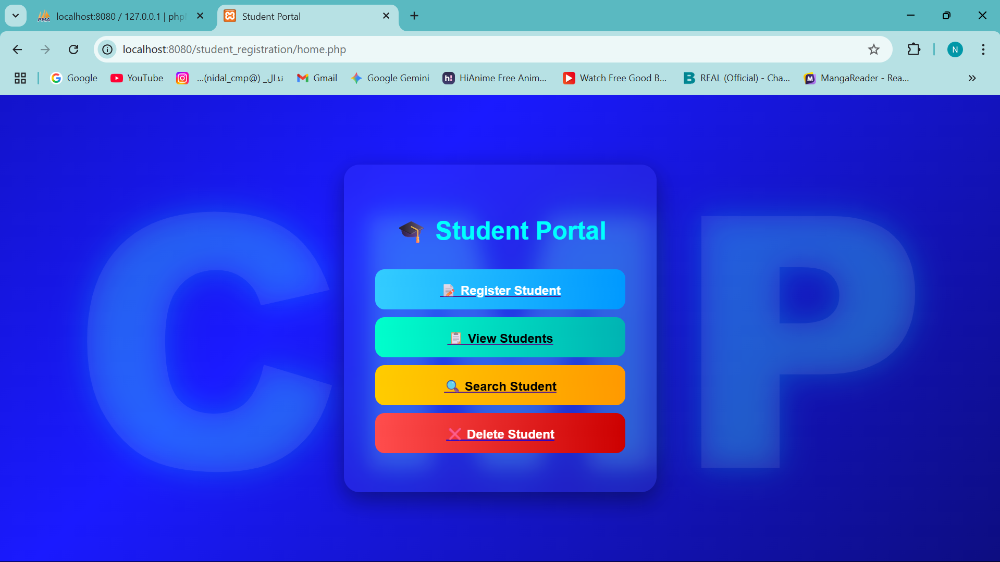
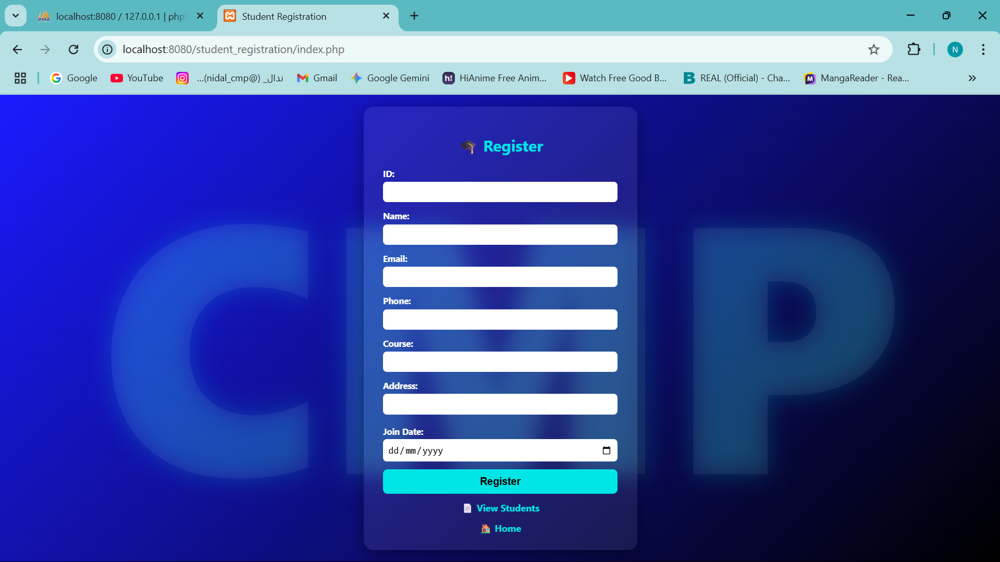
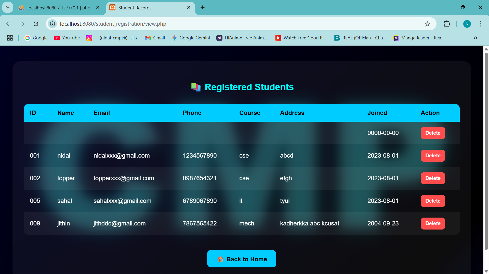
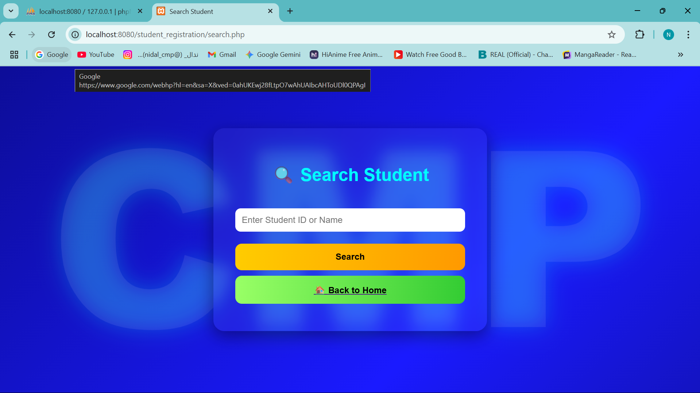
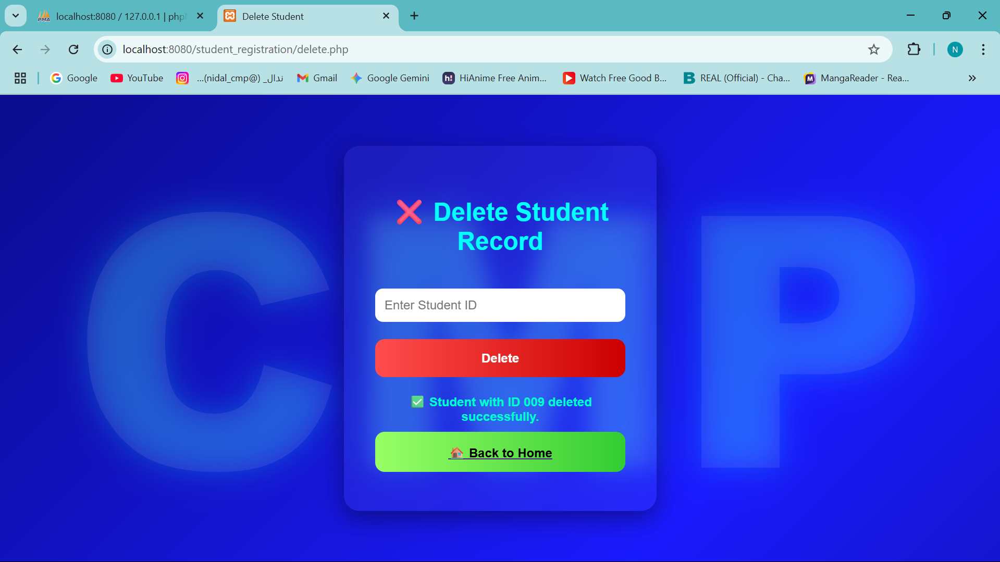

# 🎓 Student Management Portal

**Student Management Portal** is a web-based PHP application designed to simplify student data management for academic institutions.  
It enables administrators or staff to **register, view, search, and delete student records** efficiently through an intuitive and responsive interface.

---

## 📋 Table of Contents
- [About the Project](#about-the-project)
- [Key Features](#key-features)
- [Tech Stack](#tech-stack)
- [Project Screenshots](#project-screenshots)
- [Installation & Setup](#installation--setup)
- [Usage Guide](#usage-guide)
- [Future Enhancements](#future-enhancements)
- [Contributing](#contributing)
- [Author](#author)
- [License](#license)

---

## 🧠 About the Project

The **Student Management Portal** was developed as part of my learning and development in **PHP and MySQL-based web systems**.  
It serves as a **simple CRUD application** (Create, Read, Update, Delete) for managing student information securely and efficiently.  

The goal of this project is to:
- Practice **server-side scripting** with PHP  
- Understand **database connectivity** using MySQL  
- Apply **secure data handling** practices in web development  

---

## 🌟 Key Features

- 🧾 **Student Registration** – Add new students by providing their name, age, course, and contact details  
- 🔍 **Search Students** – Find students using their name, course, or unique ID  
- 📋 **View Students** – Display all registered student records in a clean table view  
- ❌ **Delete Students** – Remove a student record by their ID instantly  
- 🔒 **Secure Database Operations** – Uses prepared statements to prevent SQL injection  
- 📱 **Responsive UI** – Works smoothly on desktop and mobile browsers  

---

## 🛠 Tech Stack

| Technology | Purpose |
|-------------|----------|
| **PHP 7.4+** | Backend scripting and server-side logic |
| **MySQL** | Database management and record storage |
| **HTML5** | Page structure and forms |
| **CSS3** | Styling and responsive design |
| **XAMPP / WAMP** | Local server environment for testing |

---

## 📷 Screenshots

### 🏠 Home Page  
 


### 📝 Register Student Page 
 


### 📋 Student List View  
 


### 🔍 Search Student Page 
 


### ❌ Delete Student Page 

---

## ⚙️ Installation & Setup

Follow these steps to set up and run the project locally:

```bash
# 1️⃣ Clone the repository
git clone https://github.com/yourusername/student-portal.git

# 2️⃣ Move into the project directory
cd student-portal

# 3️⃣ Set up the MySQL database
# Open MySQL and create a new database
CREATE DATABASE student_portal;

# 4️⃣ Import the SQL schema
mysql -u root -p student_portal < database/student_portal.sql

# 5️⃣ Configure database connection in PHP files
# Update your credentials inside submit.php, search.php, view.php, and delete.php
$conn = new mysqli("localhost", "root", "", "student_portal");

# 6️⃣ Start your Apache and MySQL servers using XAMPP or WAMP
# Then, open your browser and visit:
http://localhost/student-portal/home.php

## 🧭 Usage Guide

* **🏠 Home (`home.php`):** 
    Serves as the main dashboard, providing navigation buttons to access all key features: Registering, Viewing, Searching, and Deleting students. [cite: home.jpg]

* **📝 Register (`index.php` -> `submit.php`):** 
    Access the registration form (likely `index.php`) to add new students. Enter details like ID, name, email, phone, course, address, and join date. Submitting the form (`submit.php`) validates and saves the data to the MySQL database. [cite: register.jpg]

* **📋 View Students (`view.php`):** 
    Displays a table containing all student records currently stored in the database. Each row shows student details and includes a "Delete" button. [cite: view-students.jpg]

* **🔍 Search Students (`search.php`):** 
    Allows you to find specific students by entering their **Student ID** or **Name** into the search field. Matching records (if any) will be displayed. [cite: search.jpg]

* **❌ Delete Student (`delete.php`):** 
    Accessed via the "Delete" buttons on the `view.php` page or potentially through a dedicated delete form (if `delete.php` includes one). Removes a student record from the database based on their unique ID. [cite: delete.jpg]


